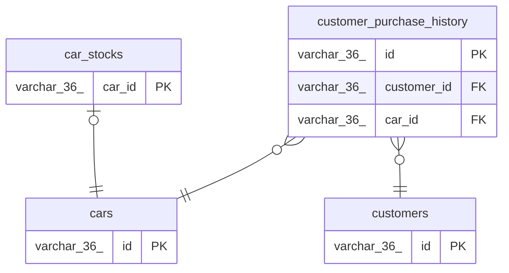

# car_site_db

## Tables

| Name | Columns | Comment | Type |
| ---- | ------- | ------- | ---- |
| [car_stocks](car_stocks.md) | 4 |  | BASE TABLE |
| [cars](cars.md) | 5 |  | BASE TABLE |
| [customer_purchase_history](customer_purchase_history.md) | 4 |  | BASE TABLE |
| [customers](customers.md) | 4 |  | BASE TABLE |

## Relations

---

> Generated by [tbls](https://github.com/k1LoW/tbls)
