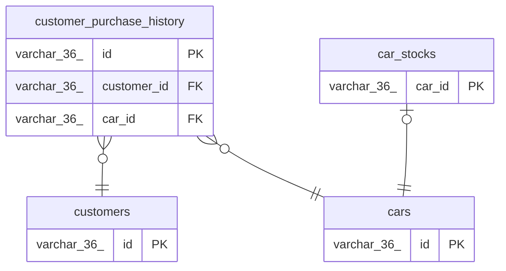

# customer_purchase_history

## Description

<details>
<summary><strong>Table Definition</strong></summary>

```sql
CREATE TABLE `customer_purchase_history` (
  `id` varchar(36) NOT NULL,
  `customer_id` varchar(36) NOT NULL,
  `car_id` varchar(36) NOT NULL,
  `created_at` timestamp NOT NULL DEFAULT CURRENT_TIMESTAMP,
  PRIMARY KEY (`id`),
  KEY `customer_id` (`customer_id`),
  KEY `car_id` (`car_id`),
  CONSTRAINT `customer_purchase_history_ibfk_1` FOREIGN KEY (`customer_id`) REFERENCES `customers` (`id`) ON DELETE CASCADE,
  CONSTRAINT `customer_purchase_history_ibfk_2` FOREIGN KEY (`car_id`) REFERENCES `cars` (`id`) ON DELETE CASCADE
) ENGINE=InnoDB DEFAULT CHARSET=utf8mb3
```

</details>

## Columns

| Name | Type | Default | Nullable | Extra Definition | Children | Parents | Comment |
| ---- | ---- | ------- | -------- | ---------------- | -------- | ------- | ------- |
| id | varchar(36) |  | false |  |  |  |  |
| customer_id | varchar(36) |  | false |  |  | [customers](customers.md) |  |
| car_id | varchar(36) |  | false |  |  | [cars](cars.md) |  |
| created_at | timestamp | CURRENT_TIMESTAMP | false | DEFAULT_GENERATED |  |  |  |

## Constraints

| Name | Type | Definition |
| ---- | ---- | ---------- |
| customer_purchase_history_ibfk_1 | FOREIGN KEY | FOREIGN KEY (customer_id) REFERENCES customers (id) |
| customer_purchase_history_ibfk_2 | FOREIGN KEY | FOREIGN KEY (car_id) REFERENCES cars (id) |
| PRIMARY | PRIMARY KEY | PRIMARY KEY (id) |

## Indexes

| Name | Definition |
| ---- | ---------- |
| car_id | KEY car_id (car_id) USING BTREE |
| customer_id | KEY customer_id (customer_id) USING BTREE |
| PRIMARY | PRIMARY KEY (id) USING BTREE |

## Relations



---

> Generated by [tbls](https://github.com/k1LoW/tbls)
